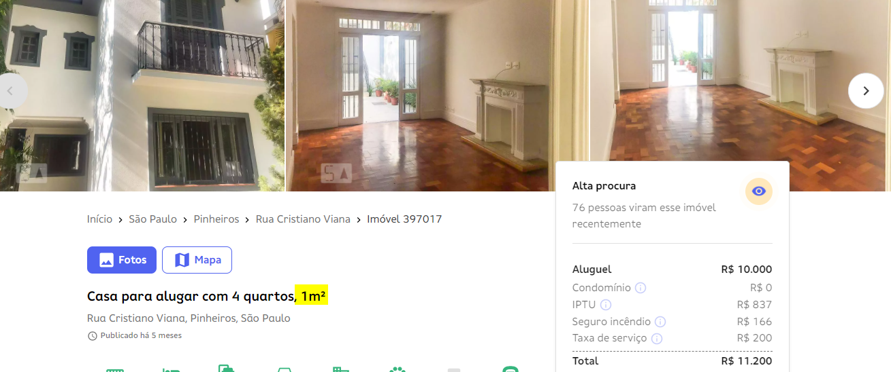
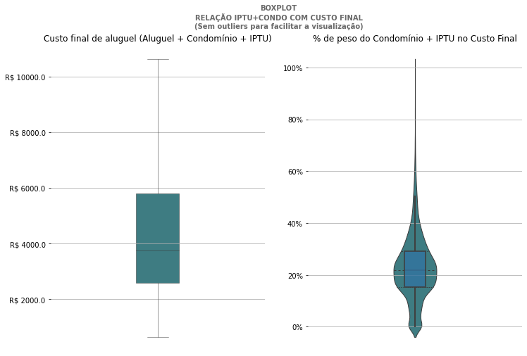
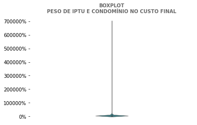
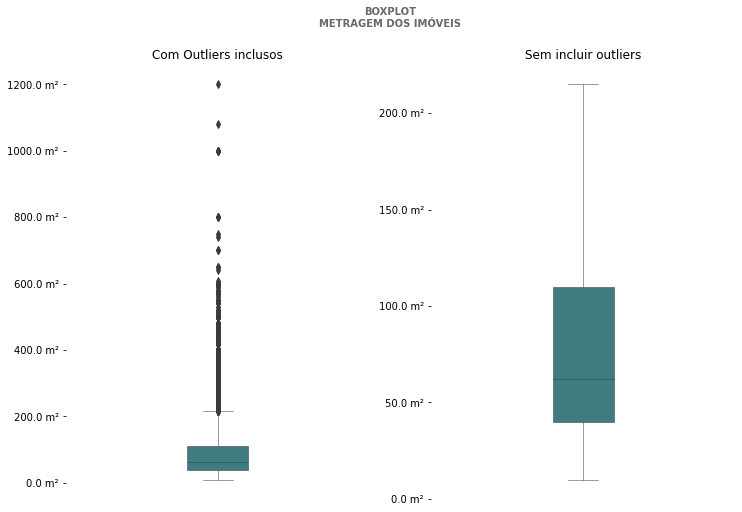
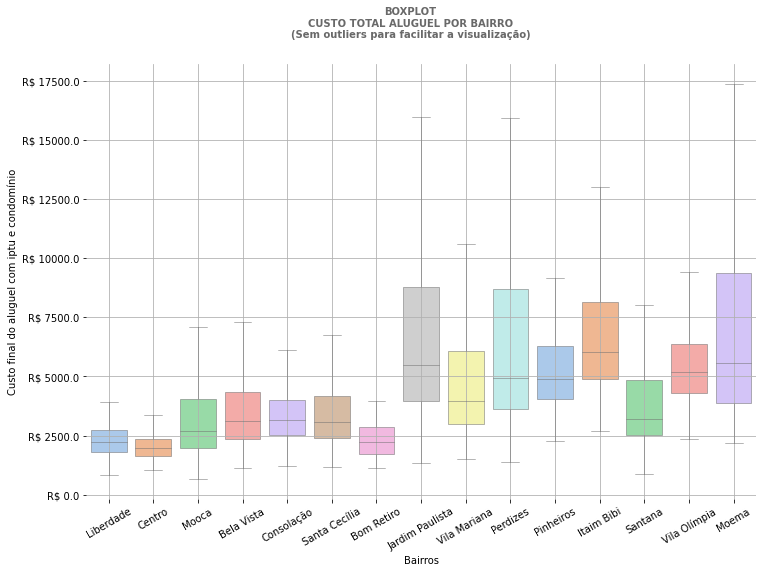
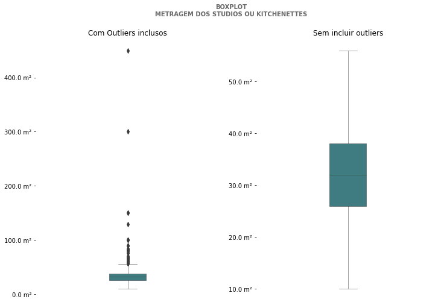
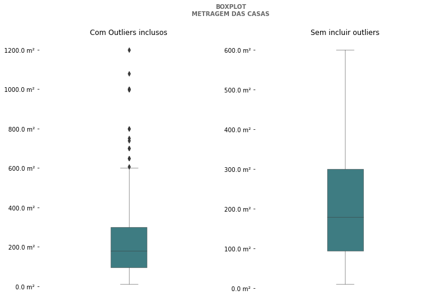
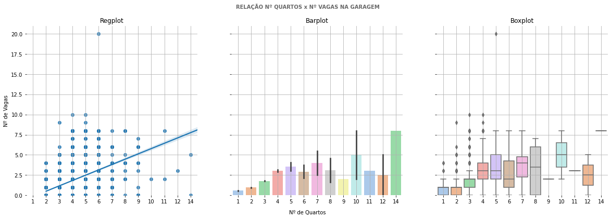
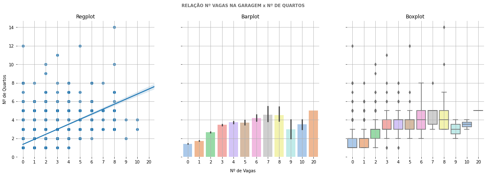
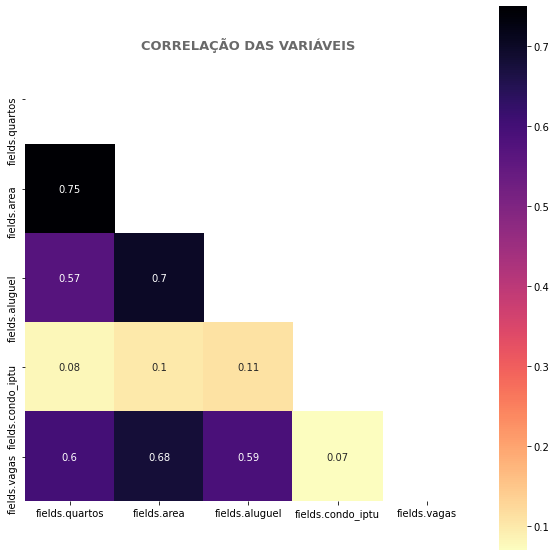

# Análise dos dados de Aluguel do QuintoAndar
***

## Motivação e proposta

+ Nesse projeto irá ser desenvolvido um Algoritmo de Machine Learning capaz de recomendar o valor a se cobrar no aluguel de um imóvel a partir de suas características (nº de quartos, vaga na garagem, metragem, etc). Para isso, a partir dos cinceitos de ETl (Extract-Transform-Load), irei extrair os dados de imóveis localizados em São Paulo no aplicativo [QuintoAndar](http://quintoandar.com.br/), explorá-lo estatísticamente e depois, escolher o melhor algoritmo para o trabalho.
+ Esse projeto terá utilidade para que os usuários saibam qual o valor de mercado esperado para seus imóveis no momento de anúnciar. Além disso, será de grande importância para meu aprendizado, colocando à prova meus conhecimentos até hoje estudados. 

## Dados

Os dados aqui utilizados foram extraídos do site do QuintoAndar pelo uso de seu API interno, estando já prontos para importação no arquivo `aluguel_unique.csv` e a única preparação feita anteriormente foi a remoção de linhas duplicadas nas respostas do API.

## Estrutura do Notebook

**1. Importações**

**2. Análise exploratória:**

Nesse momento tenta-se conhecer melhor o dataset, a partir de:

* Entender informações básicas do dataset, como tamanho, quais as variáveis, etc. E definir quais colunas utilizar.
* Conferir se há dados faltantes, se será preciso transformar alguma variável, etc.
* Análises estatísticas
   
**3. Formulação das hipóteses**

Hipóteses sobre os dados? Talvez sobre valorXregiao?
    
**4. Seleção de features para Machine Learning**

Escolher quais colunas do dataset serão realmente utilizadas. Conferir as correlações entre elas e se preciso, transformar variáveis categóricas. 

**5. Teste de diversos algoritmos de Machine Learning**

Aplica-se uma série de algoritmos e conferimos suas taxas de acerto, com isso, definiremos qual o melhor algoritmo para a proposta do projeto.
    
**6. Criação de um Pipeline para deploy**

Escolhido o algoritmo, criamos um pipeline com todo o processo de transformação e aplicação do mesmo para poder-mos fazer o deploy posteriormente.
    
**7. Conclusão do projeto**

Considerações finais do projeto.

## 1. Importações


```python
import pandas                as pd
import seaborn               as sns
import matplotlib.pyplot     as plt
import matplotlib.ticker     as mtick
import numpy                 as np
import warnings
import gc
from IPython.display         import Markdown, display
from sklearn.ensemble        import RandomForestClassifier
from sklearn.preprocessing   import LabelEncoder, OneHotEncoder, PolynomialFeatures, FunctionTransformer
from sklearn.model_selection import train_test_split, validation_curve
from sklearn.linear_model    import LinearRegression, Ridge, RidgeCV ,SGDRegressor
from sklearn.pipeline        import make_pipeline
from sklearn.preprocessing   import StandardScaler
from boruta                  import BorutaPy

warnings.filterwarnings('ignore')
pd.set_option('display.max_columns', None)
```


```python
#Para poder estruturar alguns outputs irei utilizar essa função simples feita pelo user Charles no StackOverflow (https://stackoverflow.com/a/46934204)
def printmd(string, color=None):
    colorstr = "<span style='color:{}'>{}</span>".format(color, string)
    display(Markdown(colorstr))
```


```python
db = pd.read_csv('aluguel_unique.csv')
```

## 2. Análise exploratória


```python
print('O dataset tem : {linhas} linhas e {colunas} colunas'.format(linhas=db.shape[0],colunas=db.shape[1]))
```

    O dataset tem : 10034 linhas e 22 colunas
    


```python
db.columns
```


    Index(['Unnamed: 0', '_id', 'id', 'fields.quartos', 'fields.endereco',
           'fields.id', 'fields.photo_titles', 'fields.tipo', 'fields.area',
           'fields.for_rent', 'fields.sale_price', 'fields.aluguel',
           'fields.foto_capa', 'fields.photos', 'fields.custo', 'fields.cidade',
           'fields.visit_status', 'fields.for_sale', 'fields.condo_iptu',
           'fields.vagas', 'fields.listing_tags', 'fields.regiao_nome'],
          dtype='object')


```python
db.sample(2)
```


<div>
<style scoped>
    .dataframe tbody tr th:only-of-type {
        vertical-align: middle;
    }

    .dataframe tbody tr th {
        vertical-align: top;
    }

    .dataframe thead th {
        text-align: right;
    }
</style>
<table border="1" class="dataframe">
  <thead>
    <tr style="text-align: right;">
      <th></th>
      <th>Unnamed: 0</th>
      <th>_id</th>
      <th>id</th>
      <th>fields.quartos</th>
      <th>fields.endereco</th>
      <th>fields.id</th>
      <th>fields.photo_titles</th>
      <th>fields.tipo</th>
      <th>fields.area</th>
      <th>fields.for_rent</th>
      <th>fields.sale_price</th>
      <th>fields.aluguel</th>
      <th>fields.foto_capa</th>
      <th>fields.photos</th>
      <th>fields.custo</th>
      <th>fields.cidade</th>
      <th>fields.visit_status</th>
      <th>fields.for_sale</th>
      <th>fields.condo_iptu</th>
      <th>fields.vagas</th>
      <th>fields.listing_tags</th>
      <th>fields.regiao_nome</th>
    </tr>
  </thead>
  <tbody>
    <tr>
      <th>5356</th>
      <td>5356</td>
      <td>6021ee1d3d6af61e72c96cd3</td>
      <td>893036920</td>
      <td>true</td>
      <td>Rua Apiacás</td>
      <td>893036920</td>
      <td>["Fachada","Sala Quarto","Sala Quarto","Sala Q...</td>
      <td>StudioOuKitchenette</td>
      <td>25</td>
      <td>True</td>
      <td>false</td>
      <td>1550</td>
      <td>capa893036920208_33407678239857IMG0012.jpg</td>
      <td>["893036920-208.33407678239857IMG0012.jpg","89...</td>
      <td>1601</td>
      <td>São Paulo</td>
      <td>ACCEPT_NEW</td>
      <td>False</td>
      <td>false</td>
      <td>false</td>
      <td>NaN</td>
      <td>Perdizes</td>
    </tr>
    <tr>
      <th>6292</th>
      <td>6292</td>
      <td>6021ee1d3d6af61e72c9707b</td>
      <td>893098634</td>
      <td>3</td>
      <td>Rua Artur de Azevedo</td>
      <td>893098634</td>
      <td>["Sala de estar","Sala de estar","Sala de esta...</td>
      <td>Apartamento</td>
      <td>120</td>
      <td>True</td>
      <td>false</td>
      <td>3600</td>
      <td>capa893098634902_70319427227860001892863842658...</td>
      <td>["893098634-902.70319427227860001892863842658....</td>
      <td>6478</td>
      <td>São Paulo</td>
      <td>ACCEPT_NEW</td>
      <td>False</td>
      <td>2760</td>
      <td>2</td>
      <td>NaN</td>
      <td>Pinheiros</td>
    </tr>
  </tbody>
</table>
</div>


```python
db.dtypes
```


    Unnamed: 0              int64
    _id                    object
    id                      int64
    fields.quartos         object
    fields.endereco        object
    fields.id               int64
    fields.photo_titles    object
    fields.tipo            object
    fields.area            object
    fields.for_rent          bool
    fields.sale_price      object
    fields.aluguel         object
    fields.foto_capa       object
    fields.photos          object
    fields.custo           object
    fields.cidade          object
    fields.visit_status    object
    fields.for_sale          bool
    fields.condo_iptu      object
    fields.vagas           object
    fields.listing_tags    object
    fields.regiao_nome     object
    dtype: object


```python
# Vamos entender porque existem tantas colunas numéricas com dtype de object
# Já removi algumas colunas que não são de nosso interesse, como nome das photos, etc
colunas = ['id', 'fields.quartos', 'fields.endereco',
       'fields.tipo', 'fields.area',
       'fields.for_rent', 'fields.sale_price',
       'fields.aluguel','fields.custo',
       'fields.cidade', 'fields.visit_status', 'fields.for_sale',
       'fields.condo_iptu', 'fields.vagas', 'fields.listing_tags',
       'fields.regiao_nome']
db = db[colunas]
for i in colunas:
    print(db[i].value_counts())
    print('=================================================')
```

    893102075    1
    893027674    1
    893002302    1
    893093218    1
    893229526    1
                ..
    892975390    1
    893211375    1
    893010669    1
    893242092    1
    893091840    1
    Name: id, Length: 10034, dtype: int64
    =================================================
    true    4431
    2       2660
    3       2129
    4        660
    5        101
    6         24
    8         12
    7         10
    10         2
    12         2
    14         1
    9          1
    11         1
    Name: fields.quartos, dtype: int64
    =================================================
    Rua Bela Cintra                                                                       103
    Avenida Nove de Julho                                                                  85
    Rua João Cachoeira                                                                     76
    Rua da Consolação                                                                      72
    Avenida São João                                                                       70
                                                                                         ... 
    Rua General Isidoro Dias Lopes                                                          1
    Rua Montesquiéu                                                                         1
    Oscar Cintra Gordinho                                                                   1
    R. Alonso Calhamares, 13 - Jardim Analia Franco, São Paulo - Sp, 03335-080, Brasil      1
    Rua Doutor Fomm                                                                         1
    Name: fields.endereco, Length: 2554, dtype: int64
    =================================================
    Apartamento            7201
    StudioOuKitchenette    1885
    Casa                    885
    CasaCondominio           63
    Name: fields.tipo, dtype: int64
    =================================================
    40     415
    50     322
    30     313
    35     285
    70     249
          ... 
    416      1
    363      1
    577      1
    445      1
    372      1
    Name: fields.area, Length: 376, dtype: int64
    =================================================
    True    10034
    Name: fields.for_rent, dtype: int64
    =================================================
    false        6841
    3000000        66
    1200000        66
    350000         56
    1100000        50
                 ... 
    877000          1
    2520000         1
    699990          1
    235000000       1
    3250000         1
    Name: fields.sale_price, Length: 499, dtype: int64
    =================================================
    2500    261
    3000    244
    2000    235
    3500    233
    2200    190
           ... 
    7893      1
    6460      1
    3357      1
    1211      1
    4321      1
    Name: fields.aluguel, Length: 1639, dtype: int64
    =================================================
    4282     24
    2842     20
    3765     20
    1343     16
    2045     14
             ..
    9658      1
    13488     1
    10224     1
    8218      1
    7472      1
    Name: fields.custo, Length: 5649, dtype: int64
    =================================================
    São Paulo             10032
    São Caetano do Sul        2
    Name: fields.cidade, dtype: int64
    =================================================
    ACCEPT_NEW       9586
    BLOCKED           442
    ACCEPT_ALWAYS       6
    Name: fields.visit_status, dtype: int64
    =================================================
    False    7634
    True     2400
    Name: fields.for_sale, dtype: int64
    =================================================
    false    379
    450       84
    350       78
    500       75
    400       74
            ... 
    3034       1
    2091       1
    2850       1
    6754       1
    4368       1
    Name: fields.condo_iptu, Length: 2675, dtype: int64
    =================================================
    true     4579
    false    3012
    2        1481
    3         489
    4         279
    5          86
    6          59
    8          33
    7          11
    10          2
    9           2
    20          1
    Name: fields.vagas, dtype: int64
    =================================================
    ["NEW_AD"]                                                                      1787
    ["RENT_PRICE_DECREASED"]                                                         931
    ["RENT_ON_TERMINATION","VISITS_UNAVAILABLE"]                                     325
    ["NEW_AD","RENT_PRICE_DECREASED"]                                                148
    ["RENT_ON_TERMINATION","NEW_AD","VISITS_UNAVAILABLE"]                             83
    ["NEW_AD","VISITS_UNAVAILABLE"]                                                   10
    ["RENT_ON_TERMINATION"]                                                           10
    ["VISITS_UNAVAILABLE"]                                                             9
    ["RENT_ON_TERMINATION","NEW_AD","RENT_PRICE_DECREASED","VISITS_UNAVAILABLE"]       8
    ["RENT_ON_TERMINATION","RENT_PRICE_DECREASED","VISITS_UNAVAILABLE"]                5
    ["RENT_PRICE_DECREASED","VISITS_UNAVAILABLE"]                                      1
    Name: fields.listing_tags, dtype: int64
    =================================================
    Jardim Paulista          769
    Bela Vista               631
    Consolação               627
    Santa Cecília            594
    Moema                    441
                            ... 
    Jardim Santa Emília        1
    São João Clímaco           1
    Chácara Santo Antonio      1
    Piqueri                    1
    Vila Prado                 1
    Name: fields.regiao_nome, Length: 85, dtype: int64
    =================================================
    


```python
# temos um valor 'true' na coluna de área
db['fields.area'].value_counts().true
```


    1


```python
db[db['fields.area']=='true']
```


<div>
<style scoped>
    .dataframe tbody tr th:only-of-type {
        vertical-align: middle;
    }

    .dataframe tbody tr th {
        vertical-align: top;
    }

    .dataframe thead th {
        text-align: right;
    }
</style>
<table border="1" class="dataframe">
  <thead>
    <tr style="text-align: right;">
      <th></th>
      <th>id</th>
      <th>fields.quartos</th>
      <th>fields.endereco</th>
      <th>fields.tipo</th>
      <th>fields.area</th>
      <th>fields.for_rent</th>
      <th>fields.sale_price</th>
      <th>fields.aluguel</th>
      <th>fields.custo</th>
      <th>fields.cidade</th>
      <th>fields.visit_status</th>
      <th>fields.for_sale</th>
      <th>fields.condo_iptu</th>
      <th>fields.vagas</th>
      <th>fields.listing_tags</th>
      <th>fields.regiao_nome</th>
    </tr>
  </thead>
  <tbody>
    <tr>
      <th>5198</th>
      <td>893097017</td>
      <td>4</td>
      <td>Rua Cristiano Viana</td>
      <td>Casa</td>
      <td>true</td>
      <td>True</td>
      <td>false</td>
      <td>10000</td>
      <td>11203</td>
      <td>São Paulo</td>
      <td>ACCEPT_NEW</td>
      <td>False</td>
      <td>837</td>
      <td>2</td>
      <td>NaN</td>
      <td>Pinheiros</td>
    </tr>
  </tbody>
</table>
</div>


Ao conferir no QuintoAndar, percebi que é um caso de provável erro de digitação:



```python
# temos um valor 'false' na coluna de área
db['fields.area'].value_counts().false
```


    1


```python
db[db['fields.area']=='false']
```


<div>
<style scoped>
    .dataframe tbody tr th:only-of-type {
        vertical-align: middle;
    }

    .dataframe tbody tr th {
        vertical-align: top;
    }

    .dataframe thead th {
        text-align: right;
    }
</style>
<table border="1" class="dataframe">
  <thead>
    <tr style="text-align: right;">
      <th></th>
      <th>id</th>
      <th>fields.quartos</th>
      <th>fields.endereco</th>
      <th>fields.tipo</th>
      <th>fields.area</th>
      <th>fields.for_rent</th>
      <th>fields.sale_price</th>
      <th>fields.aluguel</th>
      <th>fields.custo</th>
      <th>fields.cidade</th>
      <th>fields.visit_status</th>
      <th>fields.for_sale</th>
      <th>fields.condo_iptu</th>
      <th>fields.vagas</th>
      <th>fields.listing_tags</th>
      <th>fields.regiao_nome</th>
    </tr>
  </thead>
  <tbody>
    <tr>
      <th>7298</th>
      <td>893119312</td>
      <td>3</td>
      <td>Rua Pedroso Alvarenga</td>
      <td>Apartamento</td>
      <td>false</td>
      <td>True</td>
      <td>1500000</td>
      <td>4638</td>
      <td>5989</td>
      <td>São Paulo</td>
      <td>ACCEPT_NEW</td>
      <td>True</td>
      <td>1200</td>
      <td>true</td>
      <td>NaN</td>
      <td>Itaim Bibi</td>
    </tr>
  </tbody>
</table>
</div>


Ao conferir no QuintoAndar, percebi que provavelmente o mesmo ocorreu do anterior:


```python
# temos três valores 'false' na coluna de aluguel
db['fields.aluguel'].value_counts().false
```


    3


```python
db[db['fields.aluguel']=='false']
```


<div>
<style scoped>
    .dataframe tbody tr th:only-of-type {
        vertical-align: middle;
    }

    .dataframe tbody tr th {
        vertical-align: top;
    }

    .dataframe thead th {
        text-align: right;
    }
</style>
<table border="1" class="dataframe">
  <thead>
    <tr style="text-align: right;">
      <th></th>
      <th>id</th>
      <th>fields.quartos</th>
      <th>fields.endereco</th>
      <th>fields.tipo</th>
      <th>fields.area</th>
      <th>fields.for_rent</th>
      <th>fields.sale_price</th>
      <th>fields.aluguel</th>
      <th>fields.custo</th>
      <th>fields.cidade</th>
      <th>fields.visit_status</th>
      <th>fields.for_sale</th>
      <th>fields.condo_iptu</th>
      <th>fields.vagas</th>
      <th>fields.listing_tags</th>
      <th>fields.regiao_nome</th>
    </tr>
  </thead>
  <tbody>
    <tr>
      <th>3143</th>
      <td>893149051</td>
      <td>3</td>
      <td>Rua Taquara Branca</td>
      <td>Apartamento</td>
      <td>110</td>
      <td>True</td>
      <td>735000</td>
      <td>false</td>
      <td>1116</td>
      <td>São Paulo</td>
      <td>ACCEPT_NEW</td>
      <td>True</td>
      <td>1116</td>
      <td>2</td>
      <td>["NEW_AD"]</td>
      <td>Santana</td>
    </tr>
    <tr>
      <th>5950</th>
      <td>893242421</td>
      <td>3</td>
      <td>Rua Doutor Francisco de Paiva Carvalho</td>
      <td>CasaCondominio</td>
      <td>125</td>
      <td>True</td>
      <td>900000</td>
      <td>false</td>
      <td>175</td>
      <td>São Paulo</td>
      <td>ACCEPT_NEW</td>
      <td>True</td>
      <td>175</td>
      <td>2</td>
      <td>["NEW_AD"]</td>
      <td>Vila Maria</td>
    </tr>
    <tr>
      <th>7629</th>
      <td>893247966</td>
      <td>3</td>
      <td>Avenida Miruna</td>
      <td>Casa</td>
      <td>150</td>
      <td>True</td>
      <td>1740000</td>
      <td>false</td>
      <td>false</td>
      <td>São Paulo</td>
      <td>ACCEPT_NEW</td>
      <td>True</td>
      <td>false</td>
      <td>3</td>
      <td>["NEW_AD"]</td>
      <td>Moema</td>
    </tr>
  </tbody>
</table>
</div>


Conferindo no site percebi que foi algum erro no API no momento da coleta ou na entrada de dados, então removeremos essas colunas:


```python
#temos dois valor true em sale_price
db[db['fields.sale_price']=='true']
```


<div>
<style scoped>
    .dataframe tbody tr th:only-of-type {
        vertical-align: middle;
    }

    .dataframe tbody tr th {
        vertical-align: top;
    }

    .dataframe thead th {
        text-align: right;
    }
</style>
<table border="1" class="dataframe">
  <thead>
    <tr style="text-align: right;">
      <th></th>
      <th>id</th>
      <th>fields.quartos</th>
      <th>fields.endereco</th>
      <th>fields.tipo</th>
      <th>fields.area</th>
      <th>fields.for_rent</th>
      <th>fields.sale_price</th>
      <th>fields.aluguel</th>
      <th>fields.custo</th>
      <th>fields.cidade</th>
      <th>fields.visit_status</th>
      <th>fields.for_sale</th>
      <th>fields.condo_iptu</th>
      <th>fields.vagas</th>
      <th>fields.listing_tags</th>
      <th>fields.regiao_nome</th>
    </tr>
  </thead>
  <tbody>
    <tr>
      <th>3695</th>
      <td>893171528</td>
      <td>3</td>
      <td>Rua Tutóia</td>
      <td>Apartamento</td>
      <td>118</td>
      <td>True</td>
      <td>true</td>
      <td>4920</td>
      <td>6151</td>
      <td>São Paulo</td>
      <td>ACCEPT_NEW</td>
      <td>False</td>
      <td>1070</td>
      <td>false</td>
      <td>["RENT_PRICE_DECREASED"]</td>
      <td>Paraíso</td>
    </tr>
    <tr>
      <th>8916</th>
      <td>893084971</td>
      <td>3</td>
      <td>Avenida Divino Salvador</td>
      <td>Apartamento</td>
      <td>150</td>
      <td>True</td>
      <td>true</td>
      <td>3400</td>
      <td>5749</td>
      <td>São Paulo</td>
      <td>ACCEPT_NEW</td>
      <td>False</td>
      <td>2237</td>
      <td>true</td>
      <td>NaN</td>
      <td>Moema</td>
    </tr>
  </tbody>
</table>
</div>


Conferindo no site percebi que os imóveis não estão disponíveis para venda:


```python
#alguns nomes de regiões estão com \xa0 no fim
db['fields.regiao_nome'] = db['fields.regiao_nome'].str.replace(u'\xa0', u'')
db['fields.regiao_nome'].unique().tolist()
```


    ['Liberdade',
     'Centro',
     'Mooca',
     'Bela Vista',
     'Consolação',
     'Santa Cecília',
     'Aclimação',
     'Brás',
     'Cambuci',
     'Higienópolis',
     'Barra Funda',
     'Bom Retiro',
     'Jardim Paulista',
     'Paraíso',
     'Vila Mariana',
     'Perdizes',
     'Pacaembu',
     'Pinheiros',
     'Ipiranga',
     'Belém',
     'Casa Verde',
     'Itaim Bibi',
     'Sumaré',
     'Vila Guilherme',
     'Canindé',
     'Vila Pompéia',
     'Jardim Anália Franco',
     'Vila Nova Conceição',
     'Vila Clementino',
     'Pari',
     'Vila Maria',
     'Santana',
     'Vila Madalena',
     'Tatuapé',
     'Vila Olímpia',
     'Bosque da Saúde',
     'Chácara Inglesa',
     'Vila Ede',
     'Água Branca',
     'Moema',
     'Vila Romana',
     'Vila Prudente',
     'Vila Invernada',
     'Saúde',
     'Água Fria',
     'Jardim Europa',
     'Alto de Pinheiros',
     'Vila das Mercês',
     'Jardim Paulistano',
     'Lapa',
     'Sacomã',
     'Brooklin',
     'Vila Santa Clara',
     'Jardim América',
     'Parque Novo Mundo',
     'Mandaqui',
     'Vila Mazzei',
     'Jardim Brasil',
     'Vila Nova Cachoeirinha',
     'Planalto Paulista',
     'Freguesia do Ó',
     'Vila Gustavo',
     'Campo Belo',
     'Jardim Independência',
     'Vila Santa Maria',
     'Cidade Jardim',
     'Jabaquara',
     'Casa Verde Alta',
     'Vila Diva',
     'Real Parque',
     'São João Clímaco',
     'Vila Roque',
     'Sítio do Mandaqui',
     'Vila Prado',
     'Vila Constança',
     'Vila Amália',
     'Piqueri',
     'Jardim Avelino',
     'Jardim Santa Emília',
     'Butantã',
     'Jardim Guedala',
     'Chácara Santo Antonio',
     'Vila Santista',
     'Vila Mascote',
     'Santa Paula']


```python
db[db['fields.custo'] == 'false']
```


<div>
<style scoped>
    .dataframe tbody tr th:only-of-type {
        vertical-align: middle;
    }

    .dataframe tbody tr th {
        vertical-align: top;
    }

    .dataframe thead th {
        text-align: right;
    }
</style>
<table border="1" class="dataframe">
  <thead>
    <tr style="text-align: right;">
      <th></th>
      <th>id</th>
      <th>fields.quartos</th>
      <th>fields.endereco</th>
      <th>fields.tipo</th>
      <th>fields.area</th>
      <th>fields.for_rent</th>
      <th>fields.sale_price</th>
      <th>fields.aluguel</th>
      <th>fields.custo</th>
      <th>fields.cidade</th>
      <th>fields.visit_status</th>
      <th>fields.for_sale</th>
      <th>fields.condo_iptu</th>
      <th>fields.vagas</th>
      <th>fields.listing_tags</th>
      <th>fields.regiao_nome</th>
    </tr>
  </thead>
  <tbody>
    <tr>
      <th>7629</th>
      <td>893247966</td>
      <td>3</td>
      <td>Avenida Miruna</td>
      <td>Casa</td>
      <td>150</td>
      <td>True</td>
      <td>1740000</td>
      <td>false</td>
      <td>false</td>
      <td>São Paulo</td>
      <td>ACCEPT_NEW</td>
      <td>True</td>
      <td>false</td>
      <td>3</td>
      <td>["NEW_AD"]</td>
      <td>Moema</td>
    </tr>
  </tbody>
</table>
</div>


```python
#Existem dois imóveis de fora de São Paulo
db[db['fields.cidade']!="São Paulo"]
```


<div>
<style scoped>
    .dataframe tbody tr th:only-of-type {
        vertical-align: middle;
    }

    .dataframe tbody tr th {
        vertical-align: top;
    }

    .dataframe thead th {
        text-align: right;
    }
</style>
<table border="1" class="dataframe">
  <thead>
    <tr style="text-align: right;">
      <th></th>
      <th>id</th>
      <th>fields.quartos</th>
      <th>fields.endereco</th>
      <th>fields.tipo</th>
      <th>fields.area</th>
      <th>fields.for_rent</th>
      <th>fields.sale_price</th>
      <th>fields.aluguel</th>
      <th>fields.custo</th>
      <th>fields.cidade</th>
      <th>fields.visit_status</th>
      <th>fields.for_sale</th>
      <th>fields.condo_iptu</th>
      <th>fields.vagas</th>
      <th>fields.listing_tags</th>
      <th>fields.regiao_nome</th>
    </tr>
  </thead>
  <tbody>
    <tr>
      <th>9170</th>
      <td>893213819</td>
      <td>2</td>
      <td>Rua Alagoas</td>
      <td>Apartamento</td>
      <td>72</td>
      <td>True</td>
      <td>false</td>
      <td>3097</td>
      <td>3980</td>
      <td>São Caetano do Sul</td>
      <td>ACCEPT_NEW</td>
      <td>False</td>
      <td>782</td>
      <td>true</td>
      <td>["NEW_AD"]</td>
      <td>Centro</td>
    </tr>
    <tr>
      <th>10006</th>
      <td>893248803</td>
      <td>3</td>
      <td>Rua Rafael Correa Sampaio</td>
      <td>Apartamento</td>
      <td>176</td>
      <td>True</td>
      <td>false</td>
      <td>3774</td>
      <td>4948</td>
      <td>São Caetano do Sul</td>
      <td>ACCEPT_NEW</td>
      <td>False</td>
      <td>1051</td>
      <td>2</td>
      <td>["NEW_AD"]</td>
      <td>Santa Paula</td>
    </tr>
  </tbody>
</table>
</div>


A partir disso já temos algumas idéias de substituições que podemos fazer:
- fields.quartos
    'true': 1 quarto → conferido no site do QuintoAndar
- fields.area
    'true': media ou mediana dos valores válidos
    'false': media ou mediana dos valores válidos
- fields.sale_price
    'true': NaN
- fields.sale_price
    'false': NaN
- fields.aluguel
    'false': Remover
- fields.custo
    'false': Remover
- fields.cidade
    'São Caetano do Sul': Remover
- fields.condo_iptu
    'false': 0,
    'true': 0 → conferido que são imóveis em que não se cobra iptu nem condominio (maioria KitNets)
- fields.vagas
    'true': 1
    'false': 0
- fields.regiao_nome
    Corrigir valores com '\xa0'


```python
#substituindo colunas: quartos, sale_price, condo_iptu, vagas
db.replace({'fields.quartos':{'true':1},'fields.sale_price':{'true':np.nan,'false':np.nan},'fields.condo_iptu':{'true':0,'false':0},'fields.vagas':{'true':1,'false':0}}, inplace=True)
```


```python
db['fields.quartos'] = db['fields.quartos'].astype('int64')
print('Quartos: \n',db['fields.quartos'].dtype)

db['fields.sale_price'] = db['fields.sale_price'].astype('float')
print('Sale_price: \n',db['fields.sale_price'].dtype)
print(db['fields.sale_price'].describe())

db['fields.condo_iptu'] = db['fields.condo_iptu'].astype('float')
print('CondoIPTU: \n',db['fields.condo_iptu'].dtype)
print(db['fields.condo_iptu'].describe())

db['fields.vagas'] = db['fields.vagas'].astype('int64')
print('Vagas: \n',db['fields.vagas'].dtype)
```

    Quartos: 
     int64
    Sale_price: 
     float64
    count    2.653000e+03
    mean     1.652338e+06
    std      2.005503e+07
    min      1.000000e+02
    25%      4.300000e+05
    50%      7.200000e+05
    75%      1.250000e+06
    max      9.070000e+08
    Name: fields.sale_price, dtype: float64
    CondoIPTU: 
     float64
    count     10034.000000
    mean       1327.571557
    std        9117.059967
    min           0.000000
    25%         450.000000
    50%         807.500000
    75%        1457.000000
    max      694617.000000
    Name: fields.condo_iptu, dtype: float64
    Vagas: 
     int64
    


```python
db[db['fields.sale_price'].isna()].sample(2)
```


<div>
<style scoped>
    .dataframe tbody tr th:only-of-type {
        vertical-align: middle;
    }

    .dataframe tbody tr th {
        vertical-align: top;
    }

    .dataframe thead th {
        text-align: right;
    }
</style>
<table border="1" class="dataframe">
  <thead>
    <tr style="text-align: right;">
      <th></th>
      <th>id</th>
      <th>fields.quartos</th>
      <th>fields.endereco</th>
      <th>fields.tipo</th>
      <th>fields.area</th>
      <th>fields.for_rent</th>
      <th>fields.sale_price</th>
      <th>fields.aluguel</th>
      <th>fields.custo</th>
      <th>fields.cidade</th>
      <th>fields.visit_status</th>
      <th>fields.for_sale</th>
      <th>fields.condo_iptu</th>
      <th>fields.vagas</th>
      <th>fields.listing_tags</th>
      <th>fields.regiao_nome</th>
    </tr>
  </thead>
  <tbody>
    <tr>
      <th>5066</th>
      <td>892888709</td>
      <td>1</td>
      <td>Rua Dona Veridiana</td>
      <td>StudioOuKitchenette</td>
      <td>45</td>
      <td>True</td>
      <td>NaN</td>
      <td>1700</td>
      <td>2207</td>
      <td>São Paulo</td>
      <td>ACCEPT_NEW</td>
      <td>False</td>
      <td>451.0</td>
      <td>0</td>
      <td>NaN</td>
      <td>Santa Cecília</td>
    </tr>
    <tr>
      <th>7627</th>
      <td>893019157</td>
      <td>1</td>
      <td>Rua Doutora Neyde Apparecida Sollitto</td>
      <td>StudioOuKitchenette</td>
      <td>30</td>
      <td>True</td>
      <td>NaN</td>
      <td>1350</td>
      <td>1395</td>
      <td>São Paulo</td>
      <td>ACCEPT_NEW</td>
      <td>False</td>
      <td>0.0</td>
      <td>0</td>
      <td>NaN</td>
      <td>Vila Clementino</td>
    </tr>
  </tbody>
</table>
</div>


```python
# escolhendo entre média ou mediana da área dos aptos
db[(db['fields.area'] != 'true') & (db['fields.area'] != 'false')]['fields.area'].astype('float').describe()[['mean','50%']]
```


    mean    93.221192
    50%     62.000000
    Name: fields.area, dtype: float64


```python
# decidi optar pelo maior valor (mediana) por um dos dois anúncios ser uma casa grande
db['fields.area'].replace('true',93,inplace=True)
db['fields.area'].replace('false',93,inplace=True)
db['fields.area'] = db['fields.area'].astype('float')
print('Area: \n',db['fields.area'].dtype)
print(db['fields.area'].describe())
```

    Area: 
     float64
    count    10034.000000
    mean        93.221148
    std         89.511964
    min         10.000000
    25%         40.000000
    50%         62.000000
    75%        110.000000
    max       1200.000000
    Name: fields.area, dtype: float64
    


```python
# aluguel 'false': Remover
db = db[db['fields.aluguel'] != 'false']
```


```python
db['fields.aluguel'] = db['fields.aluguel'].astype('float')
print('Aluguel: \n',db['fields.aluguel'].dtype)
print(db['fields.aluguel'].describe().round(2))
```

    Aluguel: 
     float64
    count    10031.00
    mean      3627.24
    std       2727.27
    min        500.00
    25%       1900.00
    50%       2780.00
    75%       4300.00
    max      17432.00
    Name: fields.aluguel, dtype: float64
    


```python
# custo 'false': Remover
db = db[db['fields.custo'] != 'false']
db['fields.custo'] = db['fields.custo'].astype('float')
print('Custo: \n',db['fields.custo'].dtype)
print(db['fields.custo'].describe().round(2))
```

    Custo: 
     float64
    count     10031.00
    mean       5071.92
    std        9826.28
    min         643.00
    25%        2591.00
    50%        3765.00
    75%        5809.50
    max      702422.00
    Name: fields.custo, dtype: float64
    


```python
#cidade != SP
db = db[db['fields.cidade']=="São Paulo"]
db[db['fields.cidade']!="São Paulo"]
```


<div>
<style scoped>
    .dataframe tbody tr th:only-of-type {
        vertical-align: middle;
    }

    .dataframe tbody tr th {
        vertical-align: top;
    }

    .dataframe thead th {
        text-align: right;
    }
</style>
<table border="1" class="dataframe">
  <thead>
    <tr style="text-align: right;">
      <th></th>
      <th>id</th>
      <th>fields.quartos</th>
      <th>fields.endereco</th>
      <th>fields.tipo</th>
      <th>fields.area</th>
      <th>fields.for_rent</th>
      <th>fields.sale_price</th>
      <th>fields.aluguel</th>
      <th>fields.custo</th>
      <th>fields.cidade</th>
      <th>fields.visit_status</th>
      <th>fields.for_sale</th>
      <th>fields.condo_iptu</th>
      <th>fields.vagas</th>
      <th>fields.listing_tags</th>
      <th>fields.regiao_nome</th>
    </tr>
  </thead>
  <tbody>
  </tbody>
</table>
</div>


```python
# selecionando as colunas por tipo de variáriavel
# lembrando que a coluna sale_price tem valores NaN quando não está à venda.
numericas = ['fields.quartos','fields.area','fields.sale_price','fields.aluguel','fields.custo','fields.condo_iptu','fields.vagas']
categoricas = ['fields.tipo','fields.for_rent','fields.cidade','fields.for_sale','fields.listing_tags','fields.regiao_nome']
outras = ['id','fields.endereco','fields.sale_price']
```

#### Variáveis Numéricas


```python
db[numericas].describe().apply(lambda s: s.apply('{0:.2f}'.format))
```


<div>
<style scoped>
    .dataframe tbody tr th:only-of-type {
        vertical-align: middle;
    }

    .dataframe tbody tr th {
        vertical-align: top;
    }

    .dataframe thead th {
        text-align: right;
    }
</style>
<table border="1" class="dataframe">
  <thead>
    <tr style="text-align: right;">
      <th></th>
      <th>fields.quartos</th>
      <th>fields.area</th>
      <th>fields.sale_price</th>
      <th>fields.aluguel</th>
      <th>fields.custo</th>
      <th>fields.condo_iptu</th>
      <th>fields.vagas</th>
    </tr>
  </thead>
  <tbody>
    <tr>
      <th>count</th>
      <td>10029.00</td>
      <td>10029.00</td>
      <td>2650.00</td>
      <td>10029.00</td>
      <td>10029.00</td>
      <td>10029.00</td>
      <td>10029.00</td>
    </tr>
    <tr>
      <th>mean</th>
      <td>1.96</td>
      <td>93.20</td>
      <td>1652934.97</td>
      <td>3627.28</td>
      <td>5072.04</td>
      <td>1327.92</td>
      <td>1.13</td>
    </tr>
    <tr>
      <th>std</th>
      <td>1.08</td>
      <td>89.53</td>
      <td>20066367.66</td>
      <td>2727.54</td>
      <td>9827.25</td>
      <td>9119.31</td>
      <td>1.19</td>
    </tr>
    <tr>
      <th>min</th>
      <td>1.00</td>
      <td>10.00</td>
      <td>100.00</td>
      <td>500.00</td>
      <td>643.00</td>
      <td>0.00</td>
      <td>0.00</td>
    </tr>
    <tr>
      <th>25%</th>
      <td>1.00</td>
      <td>40.00</td>
      <td>430000.00</td>
      <td>1900.00</td>
      <td>2591.00</td>
      <td>450.00</td>
      <td>0.00</td>
    </tr>
    <tr>
      <th>50%</th>
      <td>2.00</td>
      <td>62.00</td>
      <td>720000.00</td>
      <td>2780.00</td>
      <td>3765.00</td>
      <td>808.00</td>
      <td>1.00</td>
    </tr>
    <tr>
      <th>75%</th>
      <td>3.00</td>
      <td>110.00</td>
      <td>1250000.00</td>
      <td>4300.00</td>
      <td>5810.00</td>
      <td>1457.00</td>
      <td>1.00</td>
    </tr>
    <tr>
      <th>max</th>
      <td>14.00</td>
      <td>1200.00</td>
      <td>907000000.00</td>
      <td>17432.00</td>
      <td>702422.00</td>
      <td>694617.00</td>
      <td>20.00</td>
    </tr>
  </tbody>
</table>
</div>


```python
# A partir do acima, decidi conferir o peso do condo_iptu no custo final.
(db['fields.condo_iptu']/db['fields.custo']*100).describe()
```


    count    10029.000000
    mean        22.743164
    std         12.471554
    min          0.000000
    25%         15.270634
    50%         21.895885
    75%         29.259418
    max         99.332667
    dtype: float64


A princípio, podemos extrair que:
- Metade dos imóveis não chegam a mais de 62m²
- 50% dos imóveis pagam menos de R$807.50 de IPTU+Condominio
- Menos da metade dos imóveis não tem vaga na garagem
- Os gastos com Condomínio e IPTU em média são ~23% do custo final de se alugar um imóvel


```python
fig, axes = plt.subplots(1,2, sharex=True, figsize=(12,8))
#bplt = plt.figure()
bplt = sns.boxplot(ax=axes[0],data = db['fields.custo'],width=0.2, palette = 'crest',
                linewidth = 0.5,showfliers=False)
bplt = sns.violinplot(ax=axes[1],data = db['fields.condo_iptu']/db['fields.custo']*100,width=0.2, palette = 'crest',
                linewidth = 1,showfliers=False, inner='quartile')
bplt = sns.boxplot(ax=axes[1],data = db['fields.condo_iptu']/db['fields.custo']*100,width=0.1,
                linewidth = 2,showfliers=False, showcaps=False, boxprops={'alpha':0.8,"zorder":10}, whiskerprops={"zorder":10})


fig.suptitle('''BOXPLOT
RELAÇÃO IPTU+CONDO COM CUSTO FINAL
(Sem outliers para facilitar a visualização)''',
         fontsize = 10, color ='dimgrey', fontweight = 'bold')

axes[0].set_title("Custo final de aluguel (Aluguel + Condomínio + IPTU)")
axes[1].set_title("% de peso do Condomínio + IPTU no Custo Final")

sns.despine(bottom = True, left=True)

axes[0].grid(True)
axes[1].grid(True)

plt.xticks([])
axes[0].yaxis.set_major_formatter(mtick.StrMethodFormatter('R$ {x}'))
axes[1].yaxis.set_major_formatter(mtick.PercentFormatter())
```


    

    


```python
bplt = plt.figure()
bplt = sns.violinplot(data = db['fields.custo'],width=0.2, palette = 'crest',
                linewidth = 0.5,showfliers=False)


plt.title('''BOXPLOT
PESO DE IPTU E CONDOMÍNIO NO CUSTO FINAL''',
         fontsize = 10, color ='dimgrey', fontweight = 'bold')

sns.despine(bottom = True, left=True)

plt.xticks([])
bplt.yaxis.set_major_formatter(mtick.PercentFormatter())
```


    

    


```python
fig, axes = plt.subplots(1,2, sharex=True, figsize=(12,8))
bplt = sns.boxplot(ax=axes[0],data = db['fields.area'],width=0.2, palette = 'crest',
                linewidth = 0.5,showfliers=True)
bplt2 = sns.boxplot(ax=axes[1],data = db['fields.area'],width=0.2, palette = 'crest',
                linewidth = 0.5,showfliers=False)

fig.suptitle('''BOXPLOT
METRAGEM DOS IMÓVEIS''',
         fontsize = 10, color ='dimgrey', fontweight = 'bold')

axes[0].set_title("Com Outliers inclusos")
axes[1].set_title("Sem incluir outliers")

sns.despine(bottom = True, left=True)

plt.xticks([])
axes[0].yaxis.set_major_formatter(mtick.StrMethodFormatter('{x} m²'))
axes[1].yaxis.set_major_formatter(mtick.StrMethodFormatter('{x} m²'))
```


    

    


- Interpretação:
    Como esperado, a metragem mais comum de imóveis costuma ser de 40 à 100 m². Uma possibilidade de explicar a quantidade alta de outliers seria o caso de casas e apartementos "duplex" e "triplex".

#### Variáveis Categóricas


```python
db[categoricas].describe(include=['object', 'bool'])
```


<div>
<style scoped>
    .dataframe tbody tr th:only-of-type {
        vertical-align: middle;
    }

    .dataframe tbody tr th {
        vertical-align: top;
    }

    .dataframe thead th {
        text-align: right;
    }
</style>
<table border="1" class="dataframe">
  <thead>
    <tr style="text-align: right;">
      <th></th>
      <th>fields.tipo</th>
      <th>fields.for_rent</th>
      <th>fields.cidade</th>
      <th>fields.for_sale</th>
      <th>fields.listing_tags</th>
      <th>fields.regiao_nome</th>
    </tr>
  </thead>
  <tbody>
    <tr>
      <th>count</th>
      <td>10029</td>
      <td>10029</td>
      <td>10029</td>
      <td>10029</td>
      <td>3312</td>
      <td>10029</td>
    </tr>
    <tr>
      <th>unique</th>
      <td>4</td>
      <td>1</td>
      <td>1</td>
      <td>2</td>
      <td>11</td>
      <td>84</td>
    </tr>
    <tr>
      <th>top</th>
      <td>Apartamento</td>
      <td>True</td>
      <td>São Paulo</td>
      <td>False</td>
      <td>["NEW_AD"]</td>
      <td>Jardim Paulista</td>
    </tr>
    <tr>
      <th>freq</th>
      <td>7198</td>
      <td>10029</td>
      <td>10029</td>
      <td>7632</td>
      <td>1782</td>
      <td>769</td>
    </tr>
  </tbody>
</table>
</div>


```python
for i in categoricas:
    print(db[i].value_counts())
    printmd('*=============================================================================*')
```

    Apartamento            7198
    StudioOuKitchenette    1885
    Casa                    884
    CasaCondominio           62
    Name: fields.tipo, dtype: int64
    


<span style='color:None'>*=============================================================================*</span>


    True    10029
    Name: fields.for_rent, dtype: int64
    


<span style='color:None'>*=============================================================================*</span>


    São Paulo    10029
    Name: fields.cidade, dtype: int64
    


<span style='color:None'>*=============================================================================*</span>


    False    7632
    True     2397
    Name: fields.for_sale, dtype: int64
    


<span style='color:None'>*=============================================================================*</span>


    ["NEW_AD"]                                                                      1782
    ["RENT_PRICE_DECREASED"]                                                         931
    ["RENT_ON_TERMINATION","VISITS_UNAVAILABLE"]                                     325
    ["NEW_AD","RENT_PRICE_DECREASED"]                                                148
    ["RENT_ON_TERMINATION","NEW_AD","VISITS_UNAVAILABLE"]                             83
    ["NEW_AD","VISITS_UNAVAILABLE"]                                                   10
    ["RENT_ON_TERMINATION"]                                                           10
    ["VISITS_UNAVAILABLE"]                                                             9
    ["RENT_ON_TERMINATION","NEW_AD","RENT_PRICE_DECREASED","VISITS_UNAVAILABLE"]       8
    ["RENT_ON_TERMINATION","RENT_PRICE_DECREASED","VISITS_UNAVAILABLE"]                5
    ["RENT_PRICE_DECREASED","VISITS_UNAVAILABLE"]                                      1
    Name: fields.listing_tags, dtype: int64
    


<span style='color:None'>*=============================================================================*</span>


    Jardim Paulista          769
    Bela Vista               631
    Consolação               627
    Santa Cecília            594
    Moema                    440
                            ... 
    Vila Amália                1
    Piqueri                    1
    Chácara Santo Antonio      1
    São João Clímaco           1
    Vila Constança             1
    Name: fields.regiao_nome, Length: 84, dtype: int64
    


<span style='color:None'>*=============================================================================*</span>


Das variáveis categóricas, podemos extrair:
- Maioria esmagadora dos imóveis são apartamentos
- Confirmado que todos os dados são imóveis para alugar em **SP**
- A grande maioria dos imóveis não estão à venda
- temos 85 regiões registradas, o que nos abre margem para utilizá-las no ML como feature, talvez até importando dados externos do preço do m² na região

#### Outras


```python
db[outras].describe(include=['object', 'bool'])
```


<div>
<style scoped>
    .dataframe tbody tr th:only-of-type {
        vertical-align: middle;
    }

    .dataframe tbody tr th {
        vertical-align: top;
    }

    .dataframe thead th {
        text-align: right;
    }
</style>
<table border="1" class="dataframe">
  <thead>
    <tr style="text-align: right;">
      <th></th>
      <th>fields.endereco</th>
    </tr>
  </thead>
  <tbody>
    <tr>
      <th>count</th>
      <td>10029</td>
    </tr>
    <tr>
      <th>unique</th>
      <td>2551</td>
    </tr>
    <tr>
      <th>top</th>
      <td>Rua Bela Cintra</td>
    </tr>
    <tr>
      <th>freq</th>
      <td>103</td>
    </tr>
  </tbody>
</table>
</div>


#### Explorações extras

Vamos fazer alguns cruzamentos interessantes para explorar mais a fundo os dados:


```python
#Escolhemos os 15 bairros com mais anúncios

bairros = db['fields.regiao_nome'].value_counts().index.tolist()[:15]


fig = plt.figure( figsize=(12,8))
#bplt = plt.figure()
bplt = sns.boxplot(y='fields.custo',x='fields.regiao_nome' ,data = db[db['fields.regiao_nome'].isin(bairros)],
                   palette = 'pastel',linewidth = 0.5,showfliers=False)

fig.suptitle('''BOXPLOT
CUSTO TOTAL ALUGUEL POR BAIRRO
(Sem outliers para facilitar a visualização)''',
         fontsize = 10, color ='dimgrey', fontweight = 'bold')


sns.despine(bottom = True, left=True)

bplt.grid(True)
bplt.set_xlabel('Bairros')
bplt.set_ylabel('Custo final do aluguel com iptu e condomínio')
bplt.set_xticklabels(bplt.get_xticklabels(), rotation=30)
bplt.yaxis.set_major_formatter(mtick.StrMethodFormatter('R$ {x}'))

```


    

    


- Possível interpretação: <br>
    A parentemente quanto maior a mediana de custo em um bairro, mais variam os mínimos e máximos também. Por exemplo, se comparar-mos o bairro da Mooca, que tem mediana de R\\$2.500,00 e o bairro de Moema, que tem mediana acima de R\\$5.000,00. É possivel perceber que em Moema os valores máximos e mínimos variam de ~R\\$1.500,00 até ~R\\$17.500,00, enquanto na Mooca, variam de ~R\\$1.250,00 até ~R\\$6.250,00

## 3. Formulação das hipóteses

**A partir do exposto acima, acredito que posso formular algumas hipóteses sobre os dados. Explorar essas hipóteses me auxilia a entender melhor como esse dataset está formado e como as variáveis podem interagir entre si.**

- Hipótese 1: A metragem mais comum de imóveis costuma ser de 40 à 100 m². Uma possibilidade de explicar a quantidade alta de outliers seria o caso de casas e apartementos "duplex" e "triplex".
- Hipótese 2: O motivo da relação entre a variação dos custos e as medianas é por fato de bairros mais caros (mediana maior) serem bairros mais atrativos para a população, fazendo com que abram empreendimentos para mais classes sociais.
- Hipótese 3: Na verdade, o motivo do caso acima seria pela Área maior.
- Hipótese 4: O número de vagas tende a aumentar quando o número de quartos aumenta.

### Hipótese 1

Não poderemos ter certeza sobre apartamentos "duplex" e "triplex" pois não há nenhum campo que nos informe o dado, mas poderemos explorar a presença dos outliers por categorias StudioOuKitchenette, Casa e CasaCondominio. Com isso compararemos com a presença dos mesmos nos dados totais.


```python
#fields.tipo
db['fields.tipo'].value_counts()
```


    Apartamento            7198
    StudioOuKitchenette    1885
    Casa                    884
    CasaCondominio           62
    Name: fields.tipo, dtype: int64


```python
studioOuKtc = db[db['fields.tipo']=='StudioOuKitchenette']
studioOuKtc = db.rename(columns={'fields.tipo':'tipo'}).query('tipo in ["StudioOuKitchenette"]')
fig, axes = plt.subplots(1,2, sharex=True, figsize=(12,8))

bplt = sns.boxplot(ax=axes[0],data = studioOuKtc['fields.area'].to_frame(),width=0.2, palette = 'crest',
                linewidth = 0.5,showfliers=True)
bplt2 = sns.boxplot(ax=axes[1],data = studioOuKtc['fields.area'].to_frame(),width=0.2, palette = 'crest',
                linewidth = 0.5,showfliers=False)

fig.suptitle('''BOXPLOT
METRAGEM DOS STUDIOS OU KITCHENETTES''',
         fontsize = 10, color ='dimgrey', fontweight = 'bold')

axes[0].set_title("Com Outliers inclusos")
axes[1].set_title("Sem incluir outliers")

sns.despine(bottom = True, left=True)

plt.xticks([])
axes[0].yaxis.set_major_formatter(mtick.StrMethodFormatter('{x} m²'))
axes[1].yaxis.set_major_formatter(mtick.StrMethodFormatter('{x} m²'))
```


    

    


```python
casa = db.rename(columns={'fields.tipo':'tipo'}).query('tipo in ["CasaCondominio","Casa"]')

fig, axes = plt.subplots(1,2, sharex=True, figsize=(12,8))
#bplt = plt.figure()

bplt = sns.boxplot(ax=axes[0],data = casa['fields.area'].reset_index()['fields.area'],width=0.2, palette = 'crest',
                linewidth = 0.5,showfliers=True)
bplt2 = sns.boxplot(ax=axes[1],data = casa['fields.area'].reset_index()['fields.area'],width=0.2, palette = 'crest',
                linewidth = 0.5,showfliers=False)

fig.suptitle('''BOXPLOT
METRAGEM DAS CASAS''',
         fontsize = 10, color ='dimgrey', fontweight = 'bold')

axes[0].set_title("Com Outliers inclusos")
axes[1].set_title("Sem incluir outliers")

sns.despine(bottom = True, left=True)

plt.xticks([])
axes[0].yaxis.set_major_formatter(mtick.StrMethodFormatter('{x} m²'))
axes[1].yaxis.set_major_formatter(mtick.StrMethodFormatter('{x} m²'))
```


    

    


##### Comparando o número de outliers dos três


```python
printmd('**Max e Min da fields.area dos dados totais:**')
Q1 = db.quantile(0.25)
Q3 = db.quantile(0.75)
IQR = Q3 - Q1
print((Q1 - 1.5 * IQR)['fields.area'])
print((Q3 + 1.5 * IQR)['fields.area'])
outliers =db[db['fields.area']<-56.5].count()['fields.area'] + db[db['fields.area']>195.5].count()['fields.area']
printmd('**Número de outliers presentes nessa coluna:** {outliers}'.format(outliers=outliers))
a = outliers / db['fields.area'].count() * 100
printmd('**Porcentagem de outliers sobre o número total de dados selecionados:** {a}%'.format(a=a.round(2)))

printmd('*===========================*')
printmd('**Max e Min da fields.area dos dados após filtragem por somente Studio e Kits:**')

Q1 = studioOuKtc.quantile(0.25)
Q3 = studioOuKtc.quantile(0.75)
IQR = Q3 - Q1
print((Q1 - 1.5 * IQR)['fields.area'])
print((Q3 + 1.5 * IQR)['fields.area'])
outliers =studioOuKtc[studioOuKtc['fields.area']<9.5].count()['fields.area'] + studioOuKtc[studioOuKtc['fields.area']>53.5].count()['fields.area']
printmd('**Número de outliers presentes nessa coluna:** {outliers}'.format(outliers=outliers))
a = outliers / studioOuKtc['fields.area'].count() * 100
printmd('**Porcentagem de outliers sobre o número total de dados selecionados:** {a}%'.format(a=a.round(2)))

printmd('*===========================*')
printmd('**Max e Min da fields.area dos dados após filtragem por somente Casas:**')

Q1 = casa.quantile(0.25)
Q3 = casa.quantile(0.75)
IQR = Q3 - Q1
print((Q1 - 1.5 * IQR)['fields.area'])
print((Q3 + 1.5 * IQR)['fields.area'])
outliers =casa[casa['fields.area']<9.5].count()['fields.area'] + casa[casa['fields.area']>53.5].count()['fields.area']
printmd('**Número de outliers presentes nessa coluna:** {outliers}'.format(outliers=outliers))
a = outliers / casa['fields.area'].count() * 100
printmd('**Porcentagem de outliers sobre o número total de dados selecionados:** {a}%'.format(a=a.round(2)))

#casa['fields.area'].reset_index()['fields.area']
```


<span style='color:None'>**Max e Min da fields.area dos dados totais:**</span>


    -65.0
    215.0
    


<span style='color:None'>**Número de outliers presentes nessa coluna:** 1090</span>


<span style='color:None'>**Porcentagem de outliers sobre o número total de dados selecionados:** 10.87%</span>


<span style='color:None'>*===========================*</span>


<span style='color:None'>**Max e Min da fields.area dos dados após filtragem por somente Studio e Kits:**</span>


    8.0
    56.0
    


<span style='color:None'>**Número de outliers presentes nessa coluna:** 51</span>


<span style='color:None'>**Porcentagem de outliers sobre o número total de dados selecionados:** 2.71%</span>


<span style='color:None'>*===========================*</span>


<span style='color:None'>**Max e Min da fields.area dos dados após filtragem por somente Casas:**</span>


    -212.5
    607.5
    


<span style='color:None'>**Número de outliers presentes nessa coluna:** 833</span>


<span style='color:None'>**Porcentagem de outliers sobre o número total de dados selecionados:** 88.05%</span>


Podemos afirmar que a hipótese parcialmente se confirma, pois apesar de não conseguirmos comprovar a parte de Apartamentos "duplex" e "triplex", comprovamos que Studios e Kitcheneettes contém uma porcentagem muito menor de outliers do que o dataset total, e muito menor ainda do que Casas:


|  | Dataset Total | Casas | StudiosOuKits |
|-|-|-|-|
| **% de outliers** | 9.4 | 91.01 | 2.75 |


### Hipótese 4


```python
fig, axes = plt.subplots(1,3, sharex=True, sharey=True, figsize=(20,6))
#bplt = plt.figure()
regplot = sns.regplot(ax=axes[0], y='fields.vagas',x='fields.quartos',data = db)#,
#                   palette = 'pastel')
barplot = sns.barplot(ax=axes[1], y='fields.vagas',x='fields.quartos',data = db,
                   palette = 'pastel')
bplt = sns.boxplot(ax=axes[2], y='fields.vagas',x='fields.quartos',data = db,
                   palette = 'pastel')

fig.suptitle('''RELAÇÃO Nº QUARTOS x Nº VAGAS NA GARAGEM''',
         fontsize = 10, color ='dimgrey', fontweight = 'bold')

axes[0].set_title("Regplot")
axes[1].set_title("Barplot")
axes[2].set_title("Boxplot")

sns.despine(bottom = True, left=True)

#plt.xticks([])
#plt.tick_params(labelcolor='none', top=False, bottom=False, left=False, right=False)
axes[0].set_ylabel('Nº de Vagas')
fig.text(0.5, 0.04, 'Nº de Quartos', ha='center')
for i in axes:
    i.grid(True)
    i.set_xlabel("")
    if i!=axes[0]:
        i.set_ylabel("")
```


    

    


Interpretação:<br>
    &#9; Existe uma tendência de crescimento do número de vagas disponíveis com o crescimento do número de quartos dos imóveis até 5 quartos. Após isso, a tendência perde força e varia mais, sem demonstrar muita relação. Porém, se olharmos o crescimento do número de Quartos em função do número de Vagas, algo inesperado ocorre:<br> 
    &#9; **Vemos uma tendência de crescimento mais definida e constante.**


```python
fig, axes = plt.subplots(1,3, sharex=True, sharey=True, figsize=(20,6))
#bplt = plt.figure()
regplot = sns.regplot(ax=axes[0], y='fields.quartos',x='fields.vagas',data = db)#,
#                   palette = 'pastel')
barplot = sns.barplot(ax=axes[1], y='fields.quartos',x='fields.vagas',data = db,
                   palette = 'pastel')
bplt = sns.boxplot(ax=axes[2], y='fields.quartos',x='fields.vagas',data = db,
                   palette = 'pastel')

fig.suptitle('''RELAÇÃO Nº VAGAS NA GARAGEM x Nº DE QUARTOS''',
         fontsize = 10, color ='dimgrey', fontweight = 'bold')

axes[0].set_title("Regplot")
axes[1].set_title("Barplot")
axes[2].set_title("Boxplot")

sns.despine(bottom = True, left=True)

#plt.xticks([])
#plt.tick_params(labelcolor='none', top=False, bottom=False, left=False, right=False)
axes[0].set_ylabel('Nº de Quartos')
fig.text(0.5, 0.04, 'Nº de Vagas', ha='center')
for i in axes:
    i.grid(True)
    i.set_xlabel("")
    if i!=axes[0]:
        i.set_ylabel("")
```


    

    


## 4. Seleção de features para Machine Learning


```python
numericas
#vamos dropar sale_price e custo. aluguel será nosso Target
```


    ['fields.quartos',
     'fields.area',
     'fields.sale_price',
     'fields.aluguel',
     'fields.custo',
     'fields.condo_iptu',
     'fields.vagas']


```python
categoricas
```


    ['fields.tipo',
     'fields.for_rent',
     'fields.cidade',
     'fields.for_sale',
     'fields.listing_tags',
     'fields.regiao_nome']


```python
#precisaremos transformar as categóricas em valores numéricos para o ML funcionar

for i in categoricas:
    print(i)
    print(db[i].unique(), '\n')
    
#iremos dropar for_rent, cidade e for_sale
```

    fields.tipo
    ['Apartamento' 'StudioOuKitchenette' 'Casa' 'CasaCondominio'] 
    
    fields.for_rent
    [ True] 
    
    fields.cidade
    ['São Paulo'] 
    
    fields.for_sale
    [ True False] 
    
    fields.listing_tags
    ['["NEW_AD"]' '["RENT_ON_TERMINATION","NEW_AD","VISITS_UNAVAILABLE"]'
     '["NEW_AD","RENT_PRICE_DECREASED"]' nan
     '["RENT_ON_TERMINATION","VISITS_UNAVAILABLE"]'
     '["RENT_ON_TERMINATION","NEW_AD","RENT_PRICE_DECREASED","VISITS_UNAVAILABLE"]'
     '["RENT_PRICE_DECREASED"]' '["VISITS_UNAVAILABLE"]'
     '["NEW_AD","VISITS_UNAVAILABLE"]'
     '["RENT_ON_TERMINATION","RENT_PRICE_DECREASED","VISITS_UNAVAILABLE"]'
     '["RENT_ON_TERMINATION"]' '["RENT_PRICE_DECREASED","VISITS_UNAVAILABLE"]'] 
    
    fields.regiao_nome
    ['Liberdade' 'Centro' 'Mooca' 'Bela Vista' 'Consolação' 'Santa Cecília'
     'Aclimação' 'Brás' 'Cambuci' 'Higienópolis' 'Barra Funda' 'Bom Retiro'
     'Jardim Paulista' 'Paraíso' 'Vila Mariana' 'Perdizes' 'Pacaembu'
     'Pinheiros' 'Ipiranga' 'Belém' 'Casa Verde' 'Itaim Bibi' 'Sumaré'
     'Vila Guilherme' 'Canindé' 'Vila Pompéia' 'Jardim Anália Franco'
     'Vila Nova Conceição' 'Vila Clementino' 'Pari' 'Vila Maria' 'Santana'
     'Vila Madalena' 'Tatuapé' 'Vila Olímpia' 'Bosque da Saúde'
     'Chácara Inglesa' 'Vila Ede' 'Água Branca' 'Moema' 'Vila Romana'
     'Vila Prudente' 'Vila Invernada' 'Saúde' 'Água Fria' 'Jardim Europa'
     'Alto de Pinheiros' 'Vila das Mercês' 'Jardim Paulistano' 'Lapa' 'Sacomã'
     'Brooklin' 'Vila Santa Clara' 'Jardim América' 'Parque Novo Mundo'
     'Mandaqui' 'Vila Mazzei' 'Jardim Brasil' 'Vila Nova Cachoeirinha'
     'Planalto Paulista' 'Freguesia do Ó' 'Vila Gustavo' 'Campo Belo'
     'Jardim Independência' 'Vila Santa Maria' 'Cidade Jardim' 'Jabaquara'
     'Casa Verde Alta' 'Vila Diva' 'Real Parque' 'São João Clímaco'
     'Vila Roque' 'Sítio do Mandaqui' 'Vila Prado' 'Vila Constança'
     'Vila Amália' 'Piqueri' 'Jardim Avelino' 'Jardim Santa Emília' 'Butantã'
     'Jardim Guedala' 'Chácara Santo Antonio' 'Vila Santista' 'Vila Mascote'] 
    
    


```python
db2 = db.copy()
```


```python
#Selecionando nossas colunas para conferimos as correlações
newCols = ['fields.quartos',
 'fields.area',
 'fields.aluguel',
 'fields.condo_iptu',
 'fields.vagas',
 'fields.tipo',
 'fields.listing_tags',
 'fields.regiao_nome']
db2 = db2[newCols]

db2.columns
```


    Index(['fields.quartos', 'fields.area', 'fields.aluguel', 'fields.condo_iptu',
           'fields.vagas', 'fields.tipo', 'fields.listing_tags',
           'fields.regiao_nome'],
          dtype='object')


```python
d = db2.corr().round(2)

# Plotando gráfico
plt.figure(figsize=(10, 10))

mask = np.triu(np.ones_like(d, dtype=bool))
sns.heatmap(d, annot = True, square = True, mask = mask, cmap = 'magma_r')

plt.title('CORRELAÇÃO DAS VARIÁVEIS', fontsize = 13, color ='dimgrey', fontweight = 'bold')

sns.despine(bottom = True, left=True)
```


    

    


```python
label_encoder = LabelEncoder()
ohe = OneHotEncoder()
tipoMap = {"StudioOuKitchenette":0, "Apartamento":1,"CasaCondominio":2, "Casa":3}
db2 = pd.get_dummies(db2, prefix='one_hot', columns=['fields.listing_tags', 'fields.regiao_nome'])
db2['fields.tipo'].replace(tipoMap, inplace=True)
print(db2.columns)
```

    Index(['fields.quartos', 'fields.area', 'fields.aluguel', 'fields.condo_iptu',
           'fields.vagas', 'fields.tipo',
           'one_hot_["NEW_AD","RENT_PRICE_DECREASED"]',
           'one_hot_["NEW_AD","VISITS_UNAVAILABLE"]', 'one_hot_["NEW_AD"]',
           'one_hot_["RENT_ON_TERMINATION","NEW_AD","RENT_PRICE_DECREASED","VISITS_UNAVAILABLE"]',
           ...
           'one_hot_Vila Prado', 'one_hot_Vila Prudente', 'one_hot_Vila Romana',
           'one_hot_Vila Roque', 'one_hot_Vila Santa Clara',
           'one_hot_Vila Santa Maria', 'one_hot_Vila Santista',
           'one_hot_Vila das Mercês', 'one_hot_Água Branca', 'one_hot_Água Fria'],
          dtype='object', length=101)
    

### Testando Boruta para selecionar as features

Aqui testarei a utilização do algoritmo BorutaPy, mesmo sabendo que nesse caso ele não será muito útil pela baixa quantidade de dados.
Utilizarem a versão dos dados antes da aplicação do algoritmo OneHotEncoding, pois essas colunas vão pedir uma quantidade muito grande de memória e processamento do computador


```python
cols = ['fields.quartos', 'fields.area', 'fields.aluguel', 'fields.condo_iptu', 'fields.vagas', 'fields.tipo']
db3 = db[cols]
db3['fields.tipo'].replace(tipoMap, inplace=True)
db3.columns
```


    Index(['fields.quartos', 'fields.area', 'fields.aluguel', 'fields.condo_iptu',
           'fields.vagas', 'fields.tipo'],
          dtype='object')


```python
cols = db3.columns.to_list()
print(cols)
#cols = ['fields.quartos', 'fields.area', 'fields.aluguel', 'fields.condo_iptu', 'fields.vagas', 'fields.tipo']
for i in ['fields.aluguel']:
    cols.remove(i)
    
X = db3[cols].values
y = db3['fields.aluguel'].values.ravel()

```

    ['fields.quartos', 'fields.area', 'fields.aluguel', 'fields.condo_iptu', 'fields.vagas', 'fields.tipo']
    


```python
gc.collect()
```


    44357


```python
# Define o algoritmo random forest classifier, usando todos os cores do CPU
rf = RandomForestClassifier(n_jobs=-1)

# Definir o método para Feature Selection que o Boruta vai utilizar
feat_selector = BorutaPy(rf, n_estimators='auto', verbose=1, random_state=23)

# Encontrar as features relevantes
feat_selector.fit(X, y)

# Conferir as features elecionadas
filtered_list = [i for (i, v) in zip(cols, feat_selector.support_) if v]
printmd("**Features escolhidas pelo algoritmo:** {features}".format(features=filtered_list))


# Poderiamos chamar a função transform() no X para filtrar para somente as features escolhidas
# X_filtered = feat_selector.transform(X)

```

    Iteration: 1 / 100
    Iteration: 2 / 100
    Iteration: 3 / 100
    Iteration: 4 / 100
    Iteration: 5 / 100
    Iteration: 6 / 100
    Iteration: 7 / 100
    Iteration: 8 / 100
    
    
    BorutaPy finished running.
    
    Iteration: 	9 / 100
    Confirmed: 	1
    Tentative: 	0
    Rejected: 	4
    


<span style='color:None'>**Features escolhidas pelo algoritmo:** ['fields.condo_iptu']</span>


Como falado antes, o algoritmo não vai sugerir a seleção de colunas de modo útil ou bastante funcional para esse projeto pois a quantidade de dados não está próxima do perfeito. Porém, é sempre bom testar e entender como aplicá-lo, principalmente em projetos como esse!

## 5. Teste de diversos algoritmos de Machine Learning


```python
cols = db2.columns.to_list()
print(cols)
cols.remove('fields.aluguel')
X = db2[cols]
y = db2['fields.aluguel']


X_train, X_test, y_train, y_test = train_test_split(X, y, test_size=0.33, random_state=42, stratify=db2['fields.tipo'])


```

    ['fields.quartos', 'fields.area', 'fields.aluguel', 'fields.condo_iptu', 'fields.vagas', 'fields.tipo', 'one_hot_["NEW_AD","RENT_PRICE_DECREASED"]', 'one_hot_["NEW_AD","VISITS_UNAVAILABLE"]', 'one_hot_["NEW_AD"]', 'one_hot_["RENT_ON_TERMINATION","NEW_AD","RENT_PRICE_DECREASED","VISITS_UNAVAILABLE"]', 'one_hot_["RENT_ON_TERMINATION","NEW_AD","VISITS_UNAVAILABLE"]', 'one_hot_["RENT_ON_TERMINATION","RENT_PRICE_DECREASED","VISITS_UNAVAILABLE"]', 'one_hot_["RENT_ON_TERMINATION","VISITS_UNAVAILABLE"]', 'one_hot_["RENT_ON_TERMINATION"]', 'one_hot_["RENT_PRICE_DECREASED","VISITS_UNAVAILABLE"]', 'one_hot_["RENT_PRICE_DECREASED"]', 'one_hot_["VISITS_UNAVAILABLE"]', 'one_hot_Aclimação', 'one_hot_Alto de Pinheiros', 'one_hot_Barra Funda', 'one_hot_Bela Vista', 'one_hot_Belém', 'one_hot_Bom Retiro', 'one_hot_Bosque da Saúde', 'one_hot_Brooklin', 'one_hot_Brás', 'one_hot_Butantã', 'one_hot_Cambuci', 'one_hot_Campo Belo', 'one_hot_Canindé', 'one_hot_Casa Verde', 'one_hot_Casa Verde Alta', 'one_hot_Centro', 'one_hot_Chácara Inglesa', 'one_hot_Chácara Santo Antonio', 'one_hot_Cidade Jardim', 'one_hot_Consolação', 'one_hot_Freguesia do Ó', 'one_hot_Higienópolis', 'one_hot_Ipiranga', 'one_hot_Itaim Bibi', 'one_hot_Jabaquara', 'one_hot_Jardim América', 'one_hot_Jardim Anália Franco', 'one_hot_Jardim Avelino', 'one_hot_Jardim Brasil', 'one_hot_Jardim Europa', 'one_hot_Jardim Guedala', 'one_hot_Jardim Independência', 'one_hot_Jardim Paulista', 'one_hot_Jardim Paulistano', 'one_hot_Jardim Santa Emília', 'one_hot_Lapa', 'one_hot_Liberdade', 'one_hot_Mandaqui', 'one_hot_Moema', 'one_hot_Mooca', 'one_hot_Pacaembu', 'one_hot_Paraíso', 'one_hot_Pari', 'one_hot_Parque Novo Mundo', 'one_hot_Perdizes', 'one_hot_Pinheiros', 'one_hot_Piqueri', 'one_hot_Planalto Paulista', 'one_hot_Real Parque', 'one_hot_Sacomã', 'one_hot_Santa Cecília', 'one_hot_Santana', 'one_hot_Saúde', 'one_hot_Sumaré', 'one_hot_São João Clímaco', 'one_hot_Sítio do Mandaqui', 'one_hot_Tatuapé', 'one_hot_Vila Amália', 'one_hot_Vila Clementino', 'one_hot_Vila Constança', 'one_hot_Vila Diva', 'one_hot_Vila Ede', 'one_hot_Vila Guilherme', 'one_hot_Vila Gustavo', 'one_hot_Vila Invernada', 'one_hot_Vila Madalena', 'one_hot_Vila Maria', 'one_hot_Vila Mariana', 'one_hot_Vila Mascote', 'one_hot_Vila Mazzei', 'one_hot_Vila Nova Cachoeirinha', 'one_hot_Vila Nova Conceição', 'one_hot_Vila Olímpia', 'one_hot_Vila Pompéia', 'one_hot_Vila Prado', 'one_hot_Vila Prudente', 'one_hot_Vila Romana', 'one_hot_Vila Roque', 'one_hot_Vila Santa Clara', 'one_hot_Vila Santa Maria', 'one_hot_Vila Santista', 'one_hot_Vila das Mercês', 'one_hot_Água Branca', 'one_hot_Água Fria']
    

- Vamos comparar os resultados dos algoritmos: LinearRegression, Ridge, RidgeCV


```python
def linear(X_train, X_test, y_train, y_test):
    lr = LinearRegression()
    lr.fit(X_train, y_train)
    pred = (lr.predict(X_test) - y_test).abs()
    print("LinearRegression has an error rate of R$",pred.describe()['mean'])
    score = [lr.score(X_train, y_train),lr.score(X_test, y_test)]
    return "LinearRegression made a {score1} score in train and a {score2} in test.".format(score1=score[0].round(3),
                                                                                            score2=score[1].round(3))
```


```python
def ridge(X_train, X_test, y_train, y_test):
    clf = make_pipeline(StandardScaler(), Ridge(alpha=1.0, random_state=42))
    clf.fit(X_train, y_train)
    pred = (clf.predict(X_test) - y_test).abs()
    print("RidgeRegression has an error rate of R$",pred.describe()['mean'])
    score = [clf.score(X_train, y_train),clf.score(X_test, y_test)]
    return "Ridge Regression made a {score1} score in train and a {score2} in test.".format(score1=score[0].round(3),
                                                                                            score2=score[1].round(3))
```


```python
def ridgeCV(X_train, X_test, y_train, y_test):
    rid = make_pipeline(StandardScaler(),PolynomialFeatures(degree=2), RidgeCV())
    rid.fit(X_train, y_train)
    pred = (rid.predict(X_test) - y_test).abs()
    print("RidgeCV has an error rate of R$",pred.describe()['mean'])
    score = [rid.score(X_train, y_train),rid.score(X_test, y_test)]
    return "RidgeCV made a {score1} score in train and a {score2} in test.".format(score1=score[0].round(3),
                                                                                            score2=score[1].round(3))
```


```python
gc.collect()
```


    326


```python
for i in [linear, ridge, ridgeCV]:
    print(i(X_train, X_test, y_train, y_test))
```

    LinearRegression has an error rate of R$ 1100.221590268911
    LinearRegression made a 0.63 score in train and a 0.627 in test.
    RidgeRegression has an error rate of R$ 1100.4272404326289
    Ridge Regression made a 0.63 score in train and a 0.627 in test.
    RidgeCV has an error rate of R$ 1138.1448689516485
    RidgeCV made a 0.731 score in train and a 0.028 in test.
    

### Testando algumas opções de exclusão de dados categóricos e comparando resultados

+ Excluindo o tipo de imóvel `CasaCondominio` 


```python
gc.collect()
```


    44


```python
#{"StudioOuKitchenette":0, "Apartamento":1,"CasaCondominio":2, "Casa":3}

db3 = db2.loc[(db2['fields.tipo']==0) | (db2['fields.tipo']==1) | (db2['fields.tipo']==2)]

cols = db3.columns.to_list()

cols.remove('fields.aluguel')
X = db3[cols]
y = db3['fields.aluguel']

X_train2, X_test2, y_train2, y_test2 = train_test_split(X, y, test_size=0.33, random_state=42, stratify=db3['fields.tipo'])
```


```python
for i in [linear, ridge, ridgeCV]:
    print(i(X_train2, X_test2, y_train2, y_test2))
```

    LinearRegression has an error rate of R$ 1030.170999311599
    LinearRegression made a 0.636 score in train and a 0.621 in test.
    RidgeRegression has an error rate of R$ 1031.0140073845093
    Ridge Regression made a 0.636 score in train and a 0.62 in test.
    RidgeCV has an error rate of R$ 1106.2228582332152
    RidgeCV made a 0.716 score in train and a -2.268 in test.
    

+ Mantendo somente os tipos de imóveis `StudioOuKitchenette` e `Apartamento`


```python
gc.collect()
```


    22


```python
#{"StudioOuKitchenette":0, "Apartamento":1,"CasaCondominio":2, "Casa":3}

db3 = db2.loc[(db2['fields.tipo']==0) | (db2['fields.tipo']==1)]
cols = db3.columns.to_list()
cols.remove('fields.aluguel')
X = db3[cols]
y = db3['fields.aluguel']


X_train3, X_test3, y_train3, y_test3 = train_test_split(X, y, test_size=0.33, random_state=42, stratify=db3['fields.tipo'])
```


```python
for i in [linear, ridge, ridgeCV]:
    print(i(X_train3, X_test3, y_train3, y_test3))
```

    LinearRegression has an error rate of R$ 1032.0306405182027
    LinearRegression made a 0.634 score in train and a 0.62 in test.
    RidgeRegression has an error rate of R$ 1032.8527773067328
    Ridge Regression made a 0.634 score in train and a 0.62 in test.
    RidgeCV has an error rate of R$ 1094.4678775089906
    RidgeCV made a 0.714 score in train and a -1.521 in test.
    

+ Mantendo somente o tipo de imóvel `Apartamento` 


```python
gc.collect()
```


    22


```python
#{"StudioOuKitchenette":0, "Apartamento":1,"CasaCondominio":2, "Casa":3}
db3 = db2.loc[(db2['fields.tipo']==1)]
cols = db3.columns.to_list()
cols.remove('fields.aluguel')
X = db3[cols]
y = db3['fields.aluguel']


X_train4, X_test4, y_train4, y_test4 = train_test_split(X, y, test_size=0.33, random_state=42, stratify=db3['fields.tipo'])
```


```python
for i in [linear, ridge, ridgeCV]:
    print(i(X_train4, X_test4, y_train4, y_test4))
```

    LinearRegression has an error rate of R$ 1136.909187907563
    LinearRegression made a 0.626 score in train and a 0.597 in test.
    RidgeRegression has an error rate of R$ 1138.0624788378782
    Ridge Regression made a 0.626 score in train and a 0.597 in test.
    RidgeCV has an error rate of R$ 1128.8500995977772
    RidgeCV made a 0.701 score in train and a 0.611 in test.
    

+ Mantendo somente o tipo de imóvel `StudioOuKitchenette` 


```python
gc.collect()
```


    66


```python
#{"StudioOuKitchenette":0, "Apartamento":1,"CasaCondominio":2, "Casa":3}

db3 = db2.loc[(db2['fields.tipo']==0)]
cols = db3.columns.to_list()
cols.remove('fields.aluguel')
X = db3[cols]
y = db3['fields.aluguel']


X_train5, X_test5, y_train5, y_test5 = train_test_split(X, y, test_size=0.33, random_state=42, stratify=db3['fields.tipo'])
```


```python
for i in [linear, ridge, ridgeCV]:
    print(i(X_train5, X_test5, y_train5, y_test5))
```

    LinearRegression has an error rate of R$ 603.4984091300288
    LinearRegression made a 0.531 score in train and a 0.457 in test.
    RidgeRegression has an error rate of R$ 604.6345158548531
    Ridge Regression made a 0.531 score in train and a 0.456 in test.
    RidgeCV has an error rate of R$ 779.3340732153624
    RidgeCV made a 0.754 score in train and a -10.263 in test.
    

+ Mantendo somente os tipos de imóveis `CasaCondominio` e `Casa`


```python
#{"StudioOuKitchenette":0, "Apartamento":1,"CasaCondominio":2, "Casa":3}

db3 = db2.loc[(db2['fields.tipo']==2) | (db2['fields.tipo']==3)]
cols = db3.columns.to_list()
cols.remove('fields.aluguel')
X = db3[cols]
y = db3['fields.aluguel']


X_train6, X_test6, y_train6, y_test6 = train_test_split(X, y, test_size=0.33, random_state=42, stratify=db3['fields.tipo'])
```


```python
for i in [linear, ridge, ridgeCV]:
    print(i(X_train6, X_test6, y_train6, y_test6))
```

    LinearRegression has an error rate of R$ 1582.6361231442368
    LinearRegression made a 0.726 score in train and a 0.662 in test.
    RidgeRegression has an error rate of R$ 1582.4421662264776
    Ridge Regression made a 0.726 score in train and a 0.663 in test.
    RidgeCV has an error rate of R$ 2147.3427549879493
    RidgeCV made a 0.871 score in train and a 0.318 in test.
    

+ Comparação entre os melhores resultados de cada
| Tipos includos | Melhor resultado (R² score) | Erro em R$ |
|--|--|--|
|Todos os tipos|0.627|1100.22|
|StudioOuKitchenette, Apartamento e Casa|0.621|1030.17|
|StudioOuKitchenette e Apartamento|0.62|1032.85|
|Apartamento|0.611|1128.85|
|StudioOuKitchenette|0.457|603.49|
|CasaCondominio e Casa|0.663|1582.44|

## 6. Criação de um Pipeline para deploy

Por ora, criaremos um Pipeline e função de pré-processamento a partir do feito acima, o que nos permitiria utilizar o algoritmo em um sistem automatizado. Por ora escolheremos o algoritmo que teve melhor resultado R² entre os três primeiros, uma vez que será importânte manter a categoria `Apartamentos` no algoritmo por ser a mais anunciada, que será:
+ RidgeRegression com dados de todos os tipos de imóveis


```python
def transformData(data):
    data = data[[
        'fields.quartos',        
        'fields.area',
        'fields.aluguel',
        'fields.condo_iptu',
        'fields.vagas',
        'fields.tipo',
        'fields.listing_tags',
        'fields.regiao_nome'
    ]]
    
    tipoMap={"StudioOuKitchenette":0, "Apartamento":1,"CasaCondominio":2, "Casa":3}
    data['fields.tipo'].replace(tipoMap, inplace=True)
    data = data[data['fields.tipo'].map(lambda x: int(x) in [0,1,3])]
    if len(data) < 1:
        raise ValueError("Imóvel não é do tipo suportado")
    data['fields.listing_tags'].replace({np.nan:''}, inplace=True)
    data['fields.quartos'] = data['fields.quartos'].astype('int64')
    data['fields.condo_iptu'] = data['fields.condo_iptu'].astype('float')
    data['fields.vagas'] = data['fields.vagas'].astype('int64')
    for i in data.columns:
        if data[i].isnull().any():
            print(i)
    data = pd.get_dummies(data, prefix='one_hot', columns=['fields.listing_tags', 'fields.regiao_nome'])
    #print(data.columns)
    return data
```


```python
db_pipe = pd.read_csv('aluguel_unique.csv')
db_pipe = transformData(db)
cols = db_pipe.columns.to_list()

X = db_pipe.drop(['fields.aluguel'],axis=1)
y = db_pipe['fields.aluguel']


arrays = [X, y]
lengths = [len(X) for X in arrays if X is not None]


X_train, X_test, y_train, y_test = train_test_split(X, y, test_size=0.33, random_state=42, stratify=X['fields.tipo'])


```


```python
def addMissingCols(data):
    cols = transformData(db).columns.tolist()
    
    return data.reindex(columns=cols, fill_value=0)
```


```python
Pipeline = make_pipeline(
    FunctionTransformer(addMissingCols),
    StandardScaler(),
    PolynomialFeatures(degree=2),
    Ridge()
)
Pipeline.fit(X_train, y_train)
#pred = (Pipeline.predict(X_test) - y_test).abs()
#print("RidgeCV has an error rate of R$",pred.describe()['mean'])
#score = rid.score(X_test, y_test)
```


    Pipeline(steps=[('functiontransformer',
                     FunctionTransformer(func=<function addMissingCols at 0x000001A79144E550>)),
                    ('standardscaler', StandardScaler()),
                    ('polynomialfeatures', PolynomialFeatures()),
                    ('ridge', Ridge())])


+ Dados do meu apartamento fictício:
    + Quartos: 2
    + Area: 47m²
    + Condo+IPTU:
    + Vagas: 1
    + Tipo: Apartamento


```python
np.sort(db['fields.regiao_nome'].unique())
```


    array(['Aclimação', 'Alto de Pinheiros', 'Barra Funda', 'Bela Vista',
           'Belém', 'Bom Retiro', 'Bosque da Saúde', 'Brooklin', 'Brás',
           'Butantã', 'Cambuci', 'Campo Belo', 'Canindé', 'Casa Verde',
           'Casa Verde Alta', 'Centro', 'Chácara Inglesa',
           'Chácara Santo Antonio', 'Cidade Jardim', 'Consolação',
           'Freguesia do Ó', 'Higienópolis', 'Ipiranga', 'Itaim Bibi',
           'Jabaquara', 'Jardim América', 'Jardim Anália Franco',
           'Jardim Avelino', 'Jardim Brasil', 'Jardim Europa',
           'Jardim Guedala', 'Jardim Independência', 'Jardim Paulista',
           'Jardim Paulistano', 'Jardim Santa Emília', 'Lapa', 'Liberdade',
           'Mandaqui', 'Moema', 'Mooca', 'Pacaembu', 'Paraíso', 'Pari',
           'Parque Novo Mundo', 'Perdizes', 'Pinheiros', 'Piqueri',
           'Planalto Paulista', 'Real Parque', 'Sacomã', 'Santa Cecília',
           'Santana', 'Saúde', 'Sumaré', 'São João Clímaco',
           'Sítio do Mandaqui', 'Tatuapé', 'Vila Amália', 'Vila Clementino',
           'Vila Constança', 'Vila Diva', 'Vila Ede', 'Vila Guilherme',
           'Vila Gustavo', 'Vila Invernada', 'Vila Madalena', 'Vila Maria',
           'Vila Mariana', 'Vila Mascote', 'Vila Mazzei',
           'Vila Nova Cachoeirinha', 'Vila Nova Conceição', 'Vila Olímpia',
           'Vila Pompéia', 'Vila Prado', 'Vila Prudente', 'Vila Romana',
           'Vila Roque', 'Vila Santa Clara', 'Vila Santa Maria',
           'Vila Santista', 'Vila das Mercês', 'Água Branca', 'Água Fria'],
          dtype=object)


```python
apartamento = pd.DataFrame(data={'fields.quartos':[2],
                           'fields.area':[47],
                           'fields.aluguel':[0],
                           'fields.condo_iptu':[350],
                           'fields.vagas':[1],
                           'fields.tipo':['Apartamento'],
                           'fields.regiao_nome':['Vila Mariana'],
                           'fields.listing_tags':['']
                           })


apartamento = transformData(apartamento)
apartamento = addMissingCols(apartamento)

X_apartamento = apartamento.drop(['fields.aluguel'], axis=1)
y_apartamento = apartamento['fields.aluguel']
apartamento_pred = Pipeline.predict(X_apartamento)[0].round(2)
print("Seu imóvel deve ser anúnciado, segundo o mercado, pelo valor de: R${pred}".format(pred=apartamento_pred))

```

    Seu imóvel deve ser anúnciado, segundo o mercado, pelo valor de: R$2555.52
    

## 7. Conclusão

Com esse projeto, foi possível aprender importântes lições de Análise e Ciência de Dados:
+ Mesmo com bom tratamento e feature engineering, a quantidade total de dados vai ter grande peso no resultado e acurácia finais.
+ Uma análise exploratória profunda, e muitas vezes, criativa, auxilia muito no entendimento dos dados, além de abrir chances para correções de inconsistências logo no inicio do processo.
+ Os dados, mesmo que vindo de uma API de produção consistênte, sempre devem ser revisados e conferidos em busca de erros de tipagem, de digitação, entre outros.
+ A forma como se dá a apresentação do processo de pensamento e geração de insights deve ser cuidadosamente trabalhada para garantir passar a mensagem corretamente para futuros leitores e revisadores do projeto.

Além disso, o projeto acima me auxiliou a definir os próximos focos de estudo:
+ Storytelling de Dados
+ Feature Engineering


Ideias para explorar nesse projeto futuramente:
+ K Means com análise geoespacial dos Imóveis e seus valores
